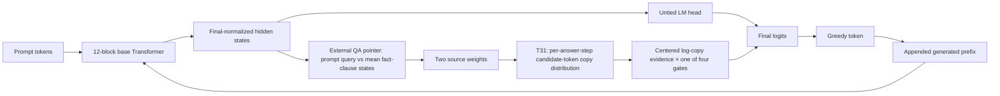

# Phase 2A post-T31 mechanistic autopsy

## 1. Executive answer

T31 did not fail because its pointer never found the source. On the shared-prefix
fork, terminal T31 selected the correct source and assigned the correct ordered
copy token the highest copy evidence in **51/64** DEV rows for seed 880001 and
**55/64** for seed 880002. Yet each seed emitted the correct native fork token in
only **30/64** rows. In the wrong-fork rows, T31 raised the correct token logit by
about 0.32–0.35, but it remained about 9.94–10.09 logits below the emitted ordinary-
LM competitor.

The most supported account is therefore an interface failure at the native token
decision: an external, shallow source-selection signal can identify the relevant
source and add compatible vocabulary evidence, but it does not form a sufficiently
integrated, prefix-stable serial emission state to overcome the ordinary LM's
competing continuation. Once that early token is wrong, autoregressive feedback
compounds the error. This is not evidence that the answer is absent everywhere in
Baby, nor that the tokenizer alone is causal.

T31 closes its exact four-gate additive copy bridge. The current-architecture
surgical line is exhausted. The appropriate recommendation is **B — architecture
redesign**, specifically reconsidering the model-internal interface between source
selection and ordered native token emission. This is not a T32 design.

## 2. What T31 actually established

T31 started from the untouched Phase1G U6000 parent
`c5406f8053ec836c099fb5a1cd3497fb5a0f7397ff366433ec63161dea0eefb1` and added
four zero-initialized scalar copy gates. The two required sequential branches ended
at U1000 with 35/128 exact+EOS each; seed 3 was correctly not run under the frozen
2-of-3 rule.

| Seed | Pointer | Native forced choice | Exact+EOS | Shared exact | Unique exact | First-token-correct then diverge |
|---:|---:|---:|---:|---:|---:|---:|
| 880001 | 102/128 | 89/128 | 35/128 | 1/64 | 34/64 | 46 |
| 880002 | 111/128 | 90/128 | 35/128 | 2/64 | 33/64 | 45 |

Language remained healthy (DEV CE 1.25595 / 1.25534), frozen binding/localizer
tensors remained identical, and TRAIN16 remained intact. The copy gates activated
with L2 0.03258 / 0.03257. Thus T31 was a valid completed test of its specified
bridge, not a mechanical or retention failure.

## 3. Exact native generation pathway

Implementation facts:

- `forward_hidden` returns the state **after the base model's final norm**; the
  untied `language_head` turns it into ordinary logits.
- In ordinary language and in QA with `layout=None`, the inherited binding/localizer
  is not called. The synthetic binding sidecar is frozen and is not the native QA
  generator's retrieval system.
- The QA pointer is an external runner/T31 computation. It L2-normalizes the final
  hidden prompt-query state and each **mean-pooled fact-clause** state, then applies
  a two-way softmax. It is recomputed during greedy generation, but its query is the
  causal prompt position, so generated suffix tokens do not alter that prompt state.
- T31 does not copy raw source-token IDs directly. To preserve answer-boundary
  tokenization, it uses frozen `candidate_token_ids` for the two source identities
  (answer-context name plus period). Pointer weights turn those two sequences into
  an ordered vocabulary distribution at steps 0–3.
- The actual final rule is additive, not a normalized mixture:
  `z_final = z_LM + copy_gate[j] * (log(copy_prob[j]) - mean_vocab_log(copy_prob[j]))`.
  EOS and later steps remain entirely on the ordinary LM path.
- The free generator greedily selects `argmax(z_final)`, appends that token, then
  recomputes the base Transformer on the changed prefix. No constrained inventory,
  reranking, gold prefix, or protected panel was used.

## 4. Metric-versus-native-path mismatch

Pointer, reversal, family, and native forced-choice are useful evidence, but none is
equivalent to free serial token generation.

- **Pointer success** is a two-way cosine comparison of a prompt query with
  mean-pooled fact clauses. It can encode *which source slot* wins without carrying
  a stable ordered lexical object through each answer step.
- **Native forced-choice** scores each full candidate under its own teacher-forced
  continuation, then compares mean log probabilities. It is a conditional sequence
  scoring computation, not the one-path greedy decision that creates its own prefix.
- **Reversal/family metrics** validate counterfactual source selection. They do not
  require every emitted answer subtoken to survive a hostile lexical competition.
- **T30/T31 activation** proves a route received gradients. It does not prove that
  the route changes an argmax or that the native generator consumes it causally.

The evidence supports “useful relational source selection,” not “a complete,
integrated answer-string state available to the free generator.”

## 5. T31 copy-bridge autopsy

The postmortem used only the 128 corrected DEV rows and the two terminal T31
checkpoints. It compared ordinary LM logits and final T31 logits at the same actual
free-running state; no parameters were changed.

| Metric at the shared identity-disambiguating fork | 880001 | 880002 |
|---|---:|---:|
| Correct pointer source / copy-top target | 51/64 | 55/64 |
| Correct emitted fork token | 30/64 | 30/64 |
| Correct source among wrong emitted forks | 26/34 | 25/34 |
| Mean correct-source pointer weight, wrong forks | 0.654 | 0.633 |
| Correct target copy-logit increment, wrong forks | +0.316 | +0.345 |
| Emitted-token copy-logit increment, wrong forks | +0.154 | +0.130 |
| Final target-versus-emitted margin, wrong forks | -10.089 | -9.941 |
| LM-only target-versus-emitted margin, wrong forks | -10.250 | -10.156 |

This separates the failure modes.

- **A. Source retrieval failure:** real but not dominant at the fork: 13/64 and
  9/64 rows had an incorrect pointer/copy source.
- **B. Ordered source-position alignment failure:** not the leading explanation at
  the fork. When the pointer chose the correct source, the ordered copy token was
  also the correct target token by construction of the frozen copy distribution.
- **C. Copy magnitude / competition failure:** directly supported. The bridge made
  the correct token relatively better by only ~0.16–0.22 logits versus the emitted
  competitor in the wrong-fork subset, leaving a roughly ten-logit deficit.
- **D. Mixture/gating failure:** T31 had no normalized probability mixture. It had
  four small positive additive gates: `[.02559,.01564,.00999,.00787]` and
  `[.02532,.01710,.00855,.00735]`. They were active but their effect was too weak
  to change the fork argmax.
- **E. Ordinary-LM domination:** directly supported for this implementation. In
  wrong-fork rows the LM-only target ranks were 211 / 256 on average; final ranks
  improved to 174 / 212, but final top-1 remained zero in both seeds.
- **F. Answer-state mismatch:** strongly supported by the prior generated-prefix
  trace and oracle rescue; a wrong early output changes all later states.

Across every row's first greedy divergence (93 per seed), the pointer/copy source
was correct in 72/93 and 79/93. The correct token received +0.376 / +0.379 logits,
but its final margin still averaged -5.067 / -4.694. This confirms the same pattern
beyond the designated shared-prefix fork.

T31 therefore did not show that correct source tokens were unavailable. It showed
that a static, shallow four-gate logit bias could not translate that availability
into the final native argmax at the critical states.

## 6. Critical-token logit competition

For the shared-fork cases where the emitted token was wrong, the direct measured
means were:

| Seed | LM correct logit | LM emitted logit | Final correct logit | Final emitted logit | Correct rank LM → final |
|---:|---:|---:|---:|---:|---:|
| 880001 | 1.671 | 11.922 | 1.987 | 12.076 | 211 → 174 |
| 880002 | 2.087 | 12.244 | 2.432 | 12.374 | 256 → 212 |

T31 raised the correct token, and generally raised it more than the wrong argmax,
but the lexical competitor retained an overwhelming lead. This is evidence for
logit competition **within T31's implementation**, not a proof that all explicit
copy/generation interfaces must fail.

## 7. Representation adequacy audit

**Pointer success is not equivalent to full answer representation.** The pointer
is source discrimination over pooled clauses. A successful result can plausibly mean
“the second fact source” rather than a serial object that constrains answer tokens
in order.

Evidence against an overly strong version of that claim is important: complete
candidate scoring can recover much more than free greedy generation, and T31's
correct-source copy distribution supplies the correct ordered target token in most
fork cases. Thus some lexical sequence information is available conditionally. What
is not established is that the **base model's native autoregressive state** stores
and uses that sequence robustly under its own generated history.

The best current wording is: relational/source representation is real and useful,
but it is insufficiently aligned with the serial, prefix-sensitive representation
that free exact generation requires.

## 8. Capacity and architecture audit

| Claim | Status | Why |
|---|---|---|
| 61.5M is intrinsically too small | **UNKNOWN** | No scale-controlled comparison establishes this. Language and narrow TRAIN16 acquisition work; repeated failure is not a parameter-count proof. |
| Language and answer generation compete for shared state | **PLAUSIBLE** | Language remains healthy while lexical competitors dominate the native fork, but no causal isolation has tested this. |
| Two-phase freezing/reversion creates incompatible representations | **WEAK** | It is a possible contributor, but source selection and language both survive; no direct evidence makes it primary. |
| The pointer subsystem is too detached from native generation | **SUPPORTED** | It is external runner logic over final pooled states. T30's residual hint and T31's shallow output bias both activate without changing free generation. |
| Auxiliary metrics can measure competence that the native generator does not integrate | **SUPPORTED** | Pointer/forced-choice remain much stronger than exact greedy output, and their computations differ from the free path. |

This is architecture/interface evidence, not an argument that more parameters alone are the answer.

## 9. The wrong-task-representation hypothesis

The hypothesis is partially supported: Baby may have learned “which source/entity is
correct” more reliably than “the ordered token sequence I must keep emitting.”

It survives because source slot selection, teacher-forced candidate scoring, and
counterfactual reversals can all succeed without a stable serial lexical object in
the free state. It is weakened by the fact that ordered candidate tokens are often
available to T31's source-conditioned copy path. T31's failure says that availability
was not enough; it does not prove the base model lacks every lexical identity code.

The falsifiable remaining distinction is not whether a correct token can sometimes be
read out. It is whether source selection can be integrated *inside the native
autoregressive state transition* so that token t commits a state appropriate for
token t+1 without relying on a shallow final-logit correction.

## 10. Closed or deprioritized explanations

- Generic answer-span CE, CE span count, higher suffix weighting, and scalar LR
  tuning.
- In-row and inventory-wide unlikelihood.
- Tokenizer replacement as the primary repair; token geometry is associated with
  failures, but append/replace studies did not justify a tokenizer intervention.
- Generic beam search and DEV-inventory reranking as native solutions.
- Training the fork harder (T29's exact objective is closed).
- A simple persistent pointer residual hint (T30).
- T31's four-step, additive centered-log copy bridge.
- “The relevant representation simply disappears after token 0.” Gold-prefix
  states retain late direct readout; the stronger result is that wrong prefixes
  change subsequent computation.

## 11. Top three surviving mechanisms

### 1. Prefix-conditioned autoregressive state-distribution mismatch — high confidence

**Mechanism:** training and forced-choice scoring condition on gold continuations,
while native greedy generation enters a state distribution after its own early token.
An early error then moves later states away from directly readable correct suffixes.

**For:** T25's teacher-forced/free gap; gold vs generated suffix trace; 108/124
single-token prefix-rescue recovery. **Against:** it does not by itself explain why
the first wrong token is selected. **Untested:** a practical causal formulation that
trains the native state transition without T26's resource cost. **Implication:**
architecture or training/curriculum redesign, not another scalar suffix loss.

### 2. Source-slot representation is not an integrated serial lexical state — moderate confidence

**Mechanism:** the external pointer can identify a fact clause but does not deliver
an ordered identity object to the model's internal answer-state transition.

**For:** pooled pointer metric, teacher-forced-vs-greedy gap, T30 and T31 failures.
**Against:** T31 did make the correct ordered copy token available often. **Untested:**
an architecture where retrieval and sequential emission are jointly represented
inside the model rather than added after final normalization. **Implication:**
architecture redesign.

### 3. Native LM prior/logit competition overwhelms shallow source evidence — high confidence for T31, moderate for the general problem

**Mechanism:** a lexical continuation prior wins the crucial argmax even when source
selection and copy target alignment are correct.

**For:** T31 audit: correct source in 51/64 and 55/64 forks, but only 30/64 correct
emissions; roughly ten-logit final deficits persisted after positive target boosts.
**Against:** a stronger integrated interface could change the state, not merely the
final logit. **Untested:** no claim beyond T31's particular four-gate bridge.
**Implication:** architecture redesign, not gate retuning.

## 12. What we now believe

Baby has learned a nontrivial contextual source-selection capability and can often
score answer strings conditionally. The native greedy mouth is a different,
prefix-sensitive computation. The current pipeline bolts external source information
onto final-normalized states or logits after the core Transformer has already formed
its ordinary language continuation preference. This repeatedly leaves the relevant
token evidence too weak at the first decisive emission; then autoregressive feedback
compounds the mistake.

## 13. What remains unknown

- Whether a model-internal retrieval/emission representation would solve the gap.
- Whether a computationally practical exposure-aware training approach can repair
  the native state transition without changing architecture.
- Whether capacity contributes once the retrieval/output interface is integrated.
- Whether the observed DEV geometry generalizes beyond the protected evaluation
  policy. No protected panel was consulted.

## 14. Final recommendation category

**B. CURRENT ARCHITECTURE SHOULD BE REDESIGNED.** Reconsider the interface by which
source localization becomes a persistent, ordered, model-internal native emission
state. The existing external final-state pointer, residual hint, and four-gate copy
logit paths are too detached from the autoregressive transition to establish the
required coexistence. This names the interface to reconsider; it does not specify,
authorize, or launch another treatment.

## Provenance and access

- New DEV-only audit protocol: `phase2a_post_t31_logit_competition_audit_v1/PROTOCOL.json`
- New DEV-only result: `phase2a_post_t31_logit_competition_audit_v1/RESULTS.json`
- Audit script: `phase2a_post_t31_logit_competition_audit_v1/RUN_AUDIT.py`
- T31 source: `phase2a_t31_native_source_copy_bridge_v1/{T31_COPY.py,T31_RUNNER.py}`
- T31 terminal reports: `phase2a_t31_native_source_copy_bridge_v1/{FINAL_REPORT.md,SUMMARY.json}`

Only `qa_dev.jsonl`, the two T31 terminal checkpoints, the frozen T31 implementation,
and architecture/configuration were read. T3 TEST, T2-EVAL-TEST, FINAL, and sacred
were not loaded, printed, copied, or scored.
